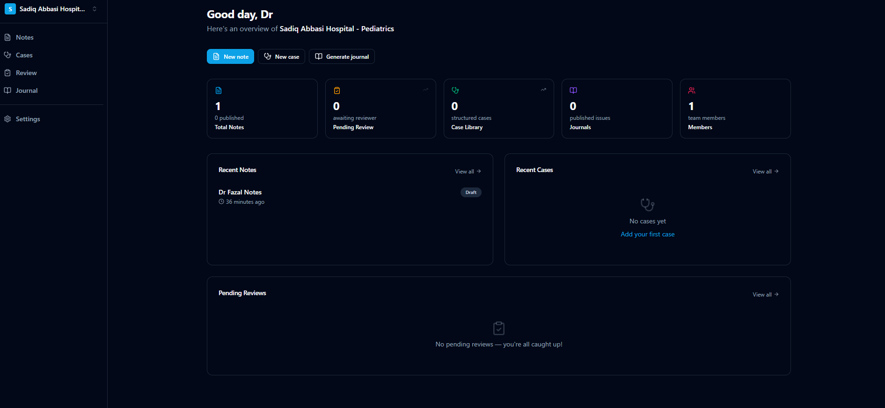

<p align="center">
  
</p>

# IlmStack Health


IlmStack Health is a clinical knowledge workspace built for hospital teams.
It helps departments capture notes, manage case libraries, run review workflows, and publish journals in one place.

## Screenshot

Add a product screenshot at `docs/screenshot-dashboard.png`, then use:

```markdown

```

## What It Includes

- Workspace-based access with role permissions (`admin`, `editor`, `contributor`, `viewer`)
- Clinical notes with statuses, tags, comments, and version history
- Structured case management with imaging support
- Review requests and approval flow
- Department journals with printable output
- Workspace settings for members, branding, and audit views

## Tech Stack

- Next.js (App Router) + React + TypeScript
- Tailwind CSS + Radix UI components
- Supabase (Auth, Postgres, Storage)
- Zod + React Hook Form for validation/forms

## Quick Start

1. Install dependencies:

```bash
npm install
```

2. Create local environment file:

```bash
cp .env.local.example .env.local
```

On Windows PowerShell:

```powershell
Copy-Item .env.local.example .env.local
```

3. Fill `.env.local` with your Supabase project values.
4. Start the app:

```bash
npm run dev
```

5. Open `http://localhost:3000`.

## Environment Variables

Required values are documented in `.env.local.example`:

- `NEXT_PUBLIC_SUPABASE_URL`
- `NEXT_PUBLIC_SUPABASE_ANON_KEY`
- `SUPABASE_SERVICE_ROLE_KEY`
- `NEXT_PUBLIC_APP_URL`
- `NEXT_PUBLIC_APP_NAME`

Optional upload limits are also included in the same file.

## Database Setup

SQL migrations are in `supabase/migrations`.

Apply them in order using your preferred Supabase workflow (CLI or SQL editor), then verify tables/policies are created before running end-to-end flows.

## Scripts

- `npm run dev` - start local dev server
- `npm run build` - production build
- `npm run start` - run production server

## Project Structure

- `src/app` - routes, layouts, server actions
- `src/components` - UI and feature components
- `src/services` - domain service layer
- `src/lib` - utilities, validations, Supabase clients
- `supabase/migrations` - schema and policy migrations
- `public` - static assets

## Notes

This project is designed for clinical collaboration workflows.
If you plan to use real patient data, make sure your deployment and operations meet your organization's legal, privacy, and security requirements.
